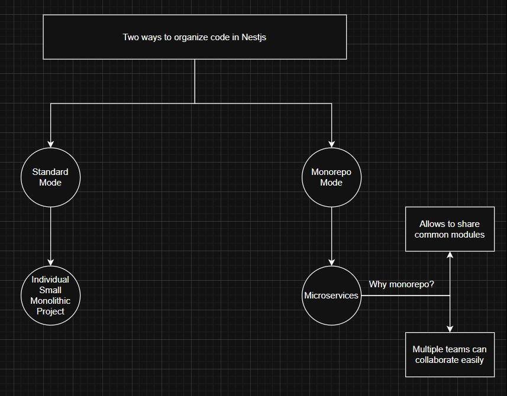
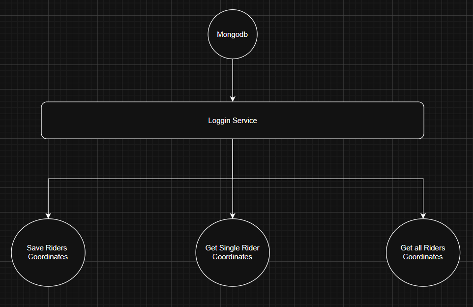
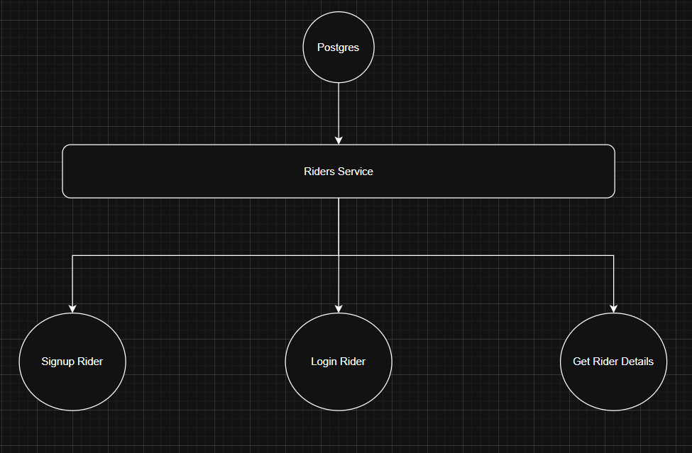

<p align="center">
  <a href="http://nestjs.com/" target="blank"></a>
</p>

[circleci-image]: https://img.shields.io/circleci/build/github/nestjs/nest/master?token=abc123def456
[circleci-url]: https://circleci.com/gh/nestjs/nest

  <p align="center">How to Create a monolithic project in nestjs and convert it to Microservice Project.</p>

# Difference between Monolithic (Standard) and Microservice (Monorepo) Architecture



# Create a Standard or Monolithic Project in Nestjs
___
Let's say we have to create a user-services monolithic project and after that i convert it to microservice project. So first we have to install the nest cli to run all the commands.

```npm
nest new uber-services
```
It creates an empty project with the required files. Now we can run it using the nest cli.
```npm
npm run start
```
Now if we open the ` http://localhost:3000 ` we can see that server is running in the browser successfully.

# Converting the Monolithic Project To Microservice Project
___

For Converting the Monolithic Project to Microservice Project, we dont required too much steps. We only required to run the new app creation command in the nest cli, it automatically converts the standard mode project in the microservice or monorepo mode project.
```npm
nest generate app logging-service
```

It Deletes the old src folder and test folder and created a new app folder having two services one is ` uber-services ` and another one is the ` logging-service `.

And Now we can create one more service called `rider-service`.
```npm
nest generate app rider-service
```
Now the important step is to change the ports of all the services in their main.ts file so that when running any of the service, it dont get conflicted with any other service.

Now you can run all the services with the command and they run on their specifies ports:

```npm
npm start logging-service

npm start rider-service

npm start user-services
```

Now we can implement our business logic inside all the microservices with their independent technology or database.

- ### Logging Service


- ### Riders Service



# Why Docker
___
Suppose we have multiple microservices , and in all the microservices we use different types of databases. So for using these types of databases, firstly we have to install it. So for installing one way is to install these tools manually one by one which is very hectic and time-consuming and hard to manage multiple databases. And the second way is to write instructions for installing all the tools in the docker compose file and run by running this single file, so that we can manage the installation and stating and stopping from one place.


# Installing Mongodb With Docker
___

For Installing and running Mongodb with docker we have to go the <a href="https://www.docker.com/products/docker-hub/">Docker Hub</a> and login with our account and search for mongod or mongodb it shows you the image file. You can pull it and run using the container.
Docker pull it from the docker hub and run inside the container for you.

### Command for running the Mongodb container:
```npm
docker run -d --name container-name -p 27017:27017 mongo:latest
```
- Pulled the official MongoDB image from Docker Hub
- Created a container named my-mongodb
- Exposed MongoDB on port 27017
- Started it successfully

The output from docker `ps confirms` it’s running:
```npm
docker ps
```
It gives the output confirms its running:
```npm
PORTS: 0.0.0.0:27017->27017/tcp
STATUS: Up
NAME: my-mongodb
```

### 🧪 Test MongoDB Connection
If you have MongoDB Compass installed, connect using:
```npm
mongodb://localhost:27017
```

You can also connect via CLI:
```npm
docker exec -it my-mongodb mongosh
```

### 🧹 Useful Commands
- ### Stop Mongodb Container
```npm
docker stop my-mongodb
```

- ### Start Mongodb Container
```npm
docker start my-mongodb
```

- ### View Logs:
```npm
docker logs my-mongodb
```
- ### Remove Container:
```npm
docker rm -f my-mongodb
```

# What is Docker Compose file
___
Docker Compose is a tool that lets you define and manage multiple containers using a single YAML configuration file (docker-compose.yml).
Instead of running multiple docker run commands, you just run:
```npm
docker compose up
```
and it spins up all containers defined in the file.

### 🧠 Basic Structure (Syntax Overview)
Here’s a minimal `docker-compose.yml` file:
```yaml
version: "3.9"  # (1) Compose file format version

services:       # (2) Define your containers here
  app:          # (3) Service name
    image: node:18
    container_name: my-node-app
    ports:
      - "3000:3000"
    volumes:
      - .:/usr/src/app
    command: npm start

  mongodb:      # Another service
    image: mongo:latest
    container_name: my-mongodb
    ports:
      - "27017:27017"
    volumes:
      - mongo-data:/data/db

volumes:        # (4) Define persistent storage
  mongo-data:

```
### ⚙️ Breakdown of Each Section
1️⃣ version

Specifies the Docker Compose file format version.

- Latest recommended: "3.8" or "3.9"
- Different versions control which syntax/features are supported.

2️⃣ services

Defines all your containers.

| Key              | Purpose                                            |
| ---------------- | -------------------------------------------------- |
| `image`          | The base image (e.g., `mongo`, `postgres`, `node`) |
| `container_name` | Optional — a friendly name for the container       |
| `ports`          | Maps container ports to your local machine         |
| `environment`    | Environment variables (e.g., DB credentials)       |
| `volumes`        | Persistent or shared file storage                  |
| `depends_on`     | Specify container startup order                    |
| `command`        | Override the default startup command               |
             |

3️⃣ volumes

Used to store data outside containers (so it persists even after restart or removal).
```yaml
volumes:
  mongo-data:
```
This creates a named volume you can reuse for your databases.

___
### 🧪 Example: MongoDB + PostgreSQL + Adminer
```yaml
version: "3.9"

services:
  mongodb:
    image: mongo:latest
    container_name: mongodb
    ports:
      - "27017:27017"
    volumes:
      - mongo-data:/data/db

  postgres:
    image: postgres:16
    container_name: postgres
    environment:
      POSTGRES_USER: admin
      POSTGRES_PASSWORD: admin123
      POSTGRES_DB: mydb
    ports:
      - "5432:5432"
    volumes:
      - pg-data:/var/lib/postgresql/data

  adminer:
    image: adminer
    container_name: adminer
    ports:
      - "8080:8080"
    depends_on:
      - postgres

volumes:
  mongo-data:
  pg-data:
```

### 🧰 Useful Commands
| Command                 | Description                          |
| ------------------------ | ------------------------------------ |
| `docker compose up`      | Start all services                   |
| `docker compose up -d`   | Start in background (detached mode)  |
| `docker compose down`    | Stop and remove all containers       |
| `docker compose ps`      | Show running containers              |
| `docker compose logs`    | View logs                            |
| `docker compose restart` | Restart all containers               |


# Why we use Docker Compose File 
___

We can also start the docker container for the specified image without using docker-compose file. But if we have multiple images and we have to manage the 
starting and stopping of the docker container it is better to write the instruction in a file. So we write these instructions in the `docker-compose.yml` file.
And after writing these things in the file, we can run the file.

```npm
docker-compose up  // for starting all the containers
docker-compose down   // for stopping the containers
```
